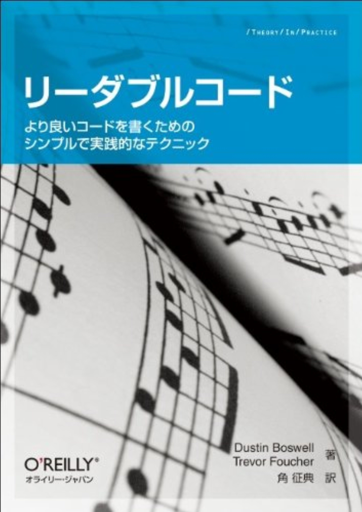
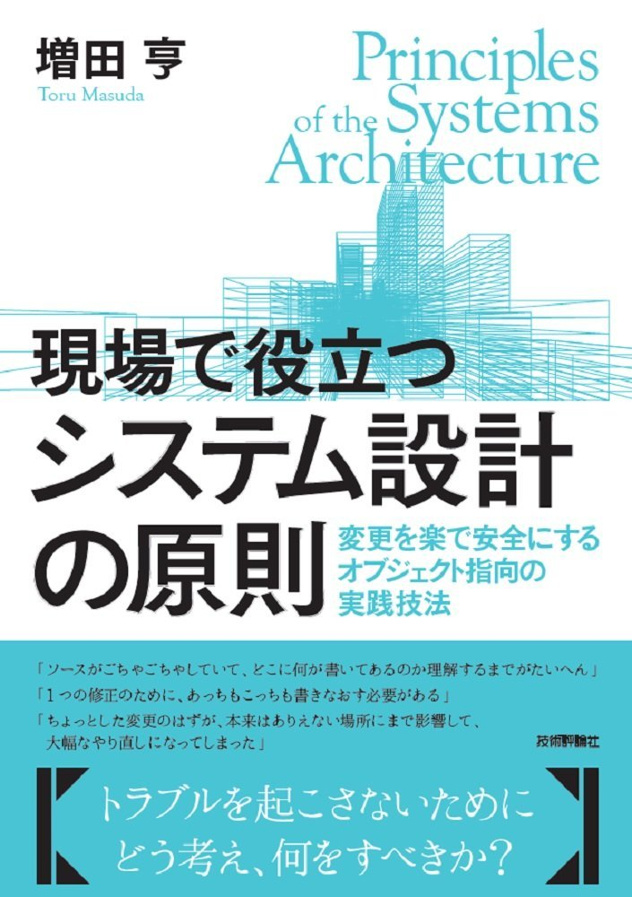

# 2017年に読んだ 本

---
## リーダブルコード
―より良いコードを書くためのシンプルで実践的なテクニック (Theory in practice) 
Dustin Boswell (著),‎ Trevor Foucher (著),‎ 須藤 功平 (解説),‎ 角 征典  (翻訳) 
 
数々のエンジニアが影響を受けた本 
簡単で短いサンプルが多く読みやすいが、内容はとても重要な事が書いてある

+++
### あるある

- 自分の書いたコードの意味が分からなくなる
- 人の書いたコードを読むのに時間がかかる

+++
自分の書くコードをキレイにすることを心がけることにより、 
思考を辿ることが出来る

---

## 現場で役立つシステム設計の原則
~変更を楽で安全にするオブジェクト指向の実践技法 
増田 亨 (著) 
 
ドメイン駆動開発、オブジェクト指向の開発手法について。

+++
- 自分たちの開発しているシステムの本質は何か？
- システムを使う人とは誰か？
- ユーザーが興味あることは何か？

---

## Joy, Inc.
ジョイ・インク 役職も部署もない全員主役のマネジメント 
リチャード・シェリダン (著),‎ 原田 騎郎 (翻訳),‎ 安井 力  (翻訳),‎ 吉羽 龍太郎  (翻訳),‎ 永瀬 美穂  (翻訳),‎ 川口 恭伸 (翻訳) 
 
 
開発プロセス・マネジメントについて。

+++
### 興味深かったこと
[センメルヴェイス・イグナーツ - Wikipedia](https://ja.wikipedia.org/wiki/%E3%82%BB%E3%83%B3%E3%83%A1%E3%83%AB%E3%83%B4%E3%82%A7%E3%82%A4%E3%82%B9%E3%83%BB%E3%82%A4%E3%82%B0%E3%83%8A%E3%83%BC%E3%83%84) 

「自分の業界で「手を洗う」に当たることを、探し出して厳格に適用すべきだ。 
厳格さと規律は難しく、明日はちゃんとやると言うのはたやすい。明日は決して来ない──違いをもたらすのはすべて今日の行動だ。 
 
重大な品質の問題について、当たり前の答えは見逃しやすい。 
厳格さと規律、そこから得られる品質は、組織が定義する「『なぜ』あなたがいるのか」を強化する。この「なぜ」については、サイモン・シネックの著書『ＷＨＹから始めよ！』で詳しく説明されている。シネックが書いているように、ほとんどの組織は何をするのか、どうやってするのかは知っていても、なぜそれをするのか知らないでいる。あなたの会社の「なぜ」は、あなたの目的、ミッション、信じているものに直結するんだ。そうした品質のレベルに到達すれば、多くの組織が最終目標と信じているゴールを達成できるようになる。文化と組織が長く続くことだ。」 

---

## 超AI時代の生存戦略
―― シンギュラリティ<2040年代>に備える34のリスト 
落合陽一 (著) 
 
 
働き方について考えさせられた。

+++
落合陽一は、「現代の魔法使い」と呼ばれている。 
詳しくは、YouTube↓ 
[【SoftBank World 2017】特別講演 落合 陽一 氏](https://youtu.be/_dUPcFfjnLE)

---

## Amazon links

[リーダブルコード](http://amzn.asia/8kdG6Ld)
[ジョイ・インク](http://amzn.asia/czIIfOo)
[超AI時代の生存戦略](http://amzn.asia/7SgaWVP)
[現場で役立つシステム設計の原則 ~変更を楽で安全にするオブジェクト指向の実践技法](http://amzn.asia/a6EJfjv)

---
# Thank you !!   ありがとう
