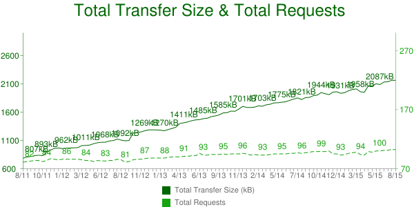
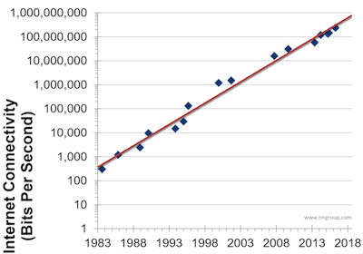
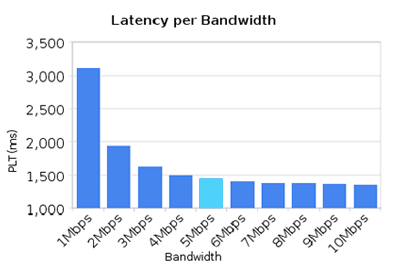
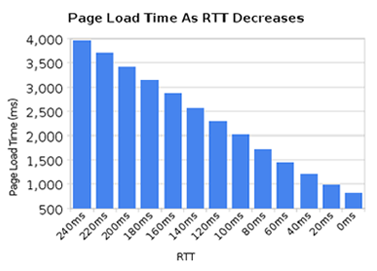
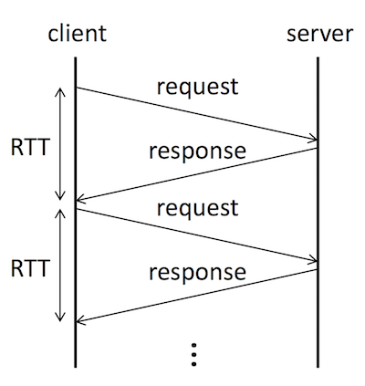
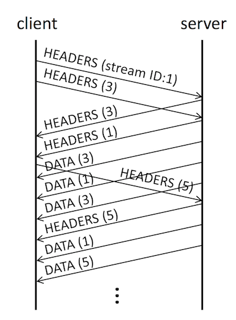

# HTTP/2

---

## サーバー技術の評価軸
- サーバ負荷
- 転送データ量
- 応答性
- 設定、運用コスト

---

## HTTP/2の登場背景

---
### 転送データは増大中

---
### エンドユーザーの通信速度は上昇
エンドユーザのバンド幅は年率50%で増加 （ニールセンの法則） 

---
### だがページロード速度は 通信速度に比例しない
1.6Mbpsで頭打ち 

---
### ページロードはレイテンシ(※1)が 小さいほど速い

---
## ※1:レイテンシ
リクエストが送信されてからレスポンスが返るまでの、**通信の遅延時間** 
[レイテンシとは (latency)](http://www.sophia-it.com/content/%E3%83%AC%E3%82%A4%E3%83%86%E3%83%B3%E3%82%B7)

---
### HTTP/1.1は多重性がない
1RTT(※2)あたり1リクエスト/レスポンスしか受信できない

- 緩和策: 複数のTCP接続を使う（制限緩和）
	- クライアントはホスト名毎に6-8接続まで使用

  

---
## ※2:RTT
ラウンドトリップタイム 
リクエストが送信されてからレスポンスが返るまでの時間 
レイテンシの大きさを表す値

---
### HTTP/1.1でどうやって Webサイトを速く表示させるか?
- CSS/JSスプライトやインライン化
- リクエストを減らすためにファイルを統合 (コンカチネーション)
- ホスト名を変えたりとか (シャーディング)

	- `a.picspot.asia`
	- `b.picspot.asia`
	- `c.picspot.asia`
	- ...

---
### HTTP/1.1パイプラインの問題
仕様上、レスポンス受信前に次のリクエストを送信可能
- 切断時に、レスポンス未受信のリクエストを再送信していいかわからない 
サーバーが同じリクエストを複数回処理する可能性があるため

- 先行リクエストの処理に時間がかかると後続が詰まる (head-of-line blocking)

↓
+++

---
レイテンシーでwebが死ぬ 
### "もうやめて、HTTP/1.1のライフはゼロよ"

---
進化したプロトコル 
## HTTP/2

- RTTの影響がより少ない
- パイプライニングとヘッドオブライン・ブロッキング問題を解決する
- ホストへの同時接続数を増やす必要性をなくす
- 既存のインターフェースや全てのコンテンツ、URIフォーマットやスキームを変更しない

Google SPDYを元に仕様策定が始まった

---
## HTTP/2とは
### 基本的な技術要素
- バイナリプロトコル
- 多重化
- ヘッダ圧縮

---
### バイナリプロトコル
- 脆弱性を防ぐ 
HTTP Response Splitting Attack [HTTP レスポンス分割攻撃](http://www.asahi-net.or.jp/~wv7y-kmr/memo/php_security.html#HTTPResponseSplitting) ヘッダー内に外部入力を使用すると、ヘッダーを改竄できる脆弱性

- 転送データ量の低減 
転送単位を小さくして、レスポンス順序変更できるように ヘッダーは圧縮されてバイナリになる

- 全てのデータは「フレーム」に分解して送受信

---
### 多重化
- リクエスト
	- 同時に100以上のリクエストを送信可能
	- 任意のタイミングでリクエスト送信可能
- レスポンス
	- レスポンスの順序に制限なし
	- レスポンスを織り交ぜ可能 
	DATAのstream IDを見よ

↓
+++

---
### ヘッダ圧縮
HTTP/1.1のヘッダは大きい
- リクエスト: 最低でも300バイト程度
- レスポンス: 通常300バイト程度

つまり100回通信するとヘッダだけで60kb 

HTTP/2では、**50%〜5%** まで圧縮できる

---
### HTTP/1.1とHTTP/2のTCPコネクション 簡易比較図

---
## レスポンス優先度
- クライアントがサーバにレスポンス優先度を指定
- サーバはその優先度を参考にレスポンスを返す順番を決める
- 優先度指定することでユーザ体感速度を大幅に向上させることができる

---
## サーバプッシュ
HTTP/2はRTTを隠蔽する技術。でも最低1RTTはいるよね?? 
→ 0RTTにできる「サーバプッシュ」 

サーバがクライアントの発行するリクエストを 予測してレスポンスをプッシュ 

↓
+++

---
## 参考
- [なぜ、我々はHTTP/2に対応する必要があるのか？](http://www.seojapan.com/blog/everyone-moving-http2)
- [で、 HTTP2.0 対応って何をすればいいの？](http://dskst9.hatenablog.com/entry/2016/01/30/235019)
- [HTTPとサーバ技術の最新動向](https://www.slideshare.net/kazuho/http-58452175)

---
## http2-explained
- [http2 explained - The HTTP/2 book](https://daniel.haxx.se/http2/)

この http2-explained の中に仕様策定のコンセプトがあり、 プロダクト開発にも通じる言葉が心に響いた

---
## あと
- サーバーの実装方法もGithubにたくさんある、GoやC++での実装が多い印象
- ブラウザ・サーバー設定・アプリケーション側の対応方法もサンプルたくさん

HTTP/2 仕様(RFC 7540) は、2015年5月15日に公式に発行されました 
技術キャッチアップちゃんとします

---?image=assets/images/IMG_9970.JPG&size=cover

<h2 style="background:rgba(255, 255, 255, 0.7); line-height:3; color:#780A1E">Thank you!!</h2>
