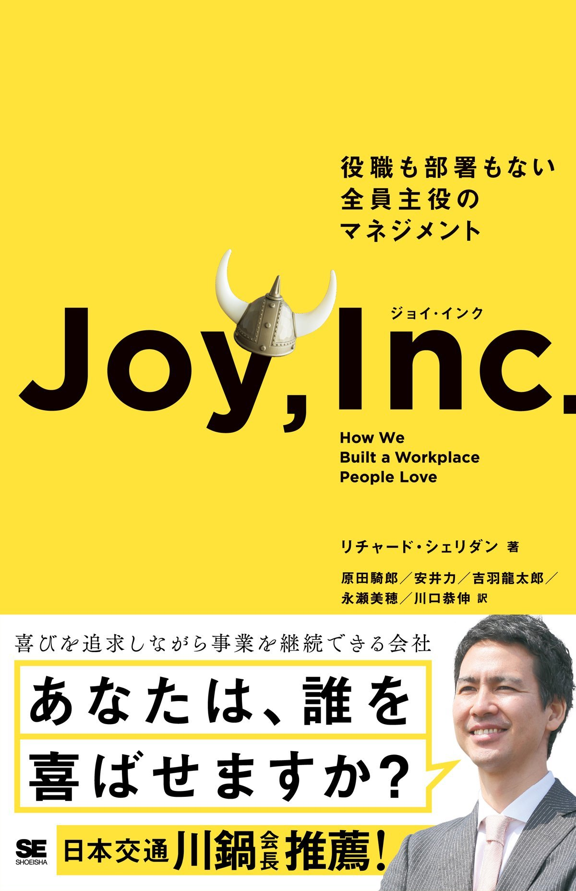
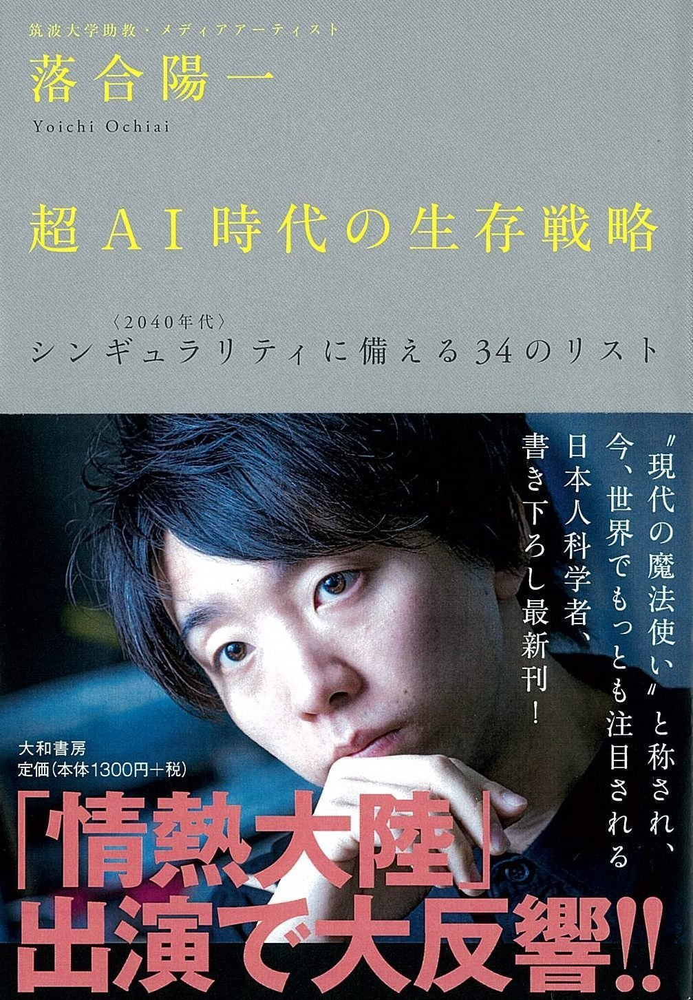

# 2017年に読んだ 本

## リーダブルコード

---

## Joy, Inc.

 
開発プロセス・マネジメント

---

---

## 超AI時代の生存戦略 ―― シンギュラリティ<2040年代>に備える34のリスト

落合陽一
 
働き方

+++

---

## システム設計のなんちゃら

+++

## 参考に

- [Google Apps Scriptを使い日々のコピペ作業から解放できた話 - Qiita](https://qiita.com/moonstruckdrops@github/items/d791bc7f0b7a2c2e6b5d)
- [SpreadSheetでスクレイピング。Importxml他、便利な関数9+1 - Qiita](https://qiita.com/ktmg/items/d53440c913e20f8bb34c)
- [Treasure DataとGoogleスプレッドシートで作るお手軽KPIダッシュボード - Qiita](https://qiita.com/highwide/items/9a75428e8e8bda0325db)